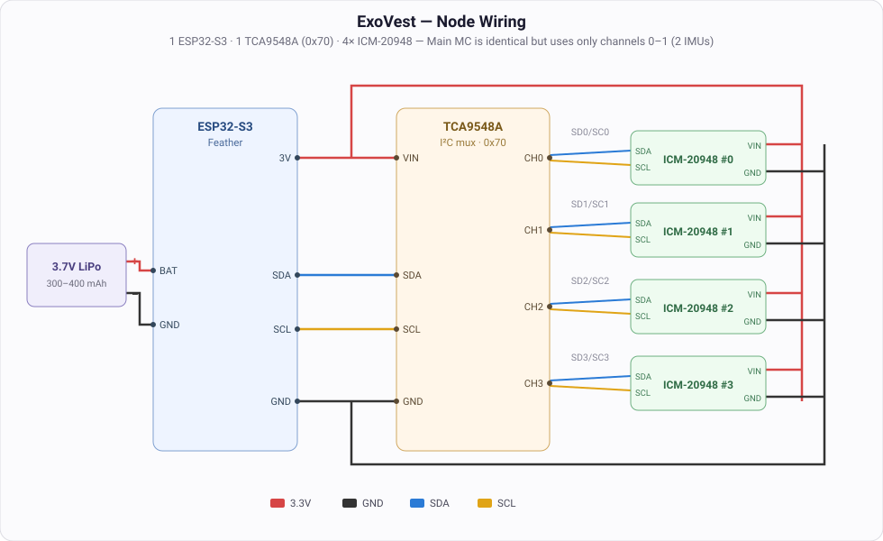

# Hardware

## Bill of materials

| Part | Qty | Role |
|------|-----|------|
| ESP32-S3 Feather (4MB Flash / 2MB PSRAM) | 3 | 2 nodes + 1 main MC |
| TDK InvenSense ICM-20948 9-DoF IMU | 10 | 4 per arm node, 2 on torso (main) |
| TCA9548A I2C multiplexer | 3 | one per MC — lets multiple same-address IMUs share one I2C bus |
| 3.7V LiPo battery (300–400 mAh) | 3 | one per MC |
| Micro-LiPo USB-C charger | 3 | charges the LiPos |
| Perma-Proto quarter breadboard | 3 | common ground / power bus |
| F/F + M/F jumper wires | — | IMU ↔ mux ↔ MC connections |

## Sensor placement

Each arm node reads 4 IMUs; the main MC reads 2 on the torso:

| MC | IMUs | Locations |
|----|------|-----------|
| Node A (arm) | 4 | wrist, forearm, upper arm, shoulder |
| Node B (arm) | 4 | wrist, forearm, upper arm, shoulder |
| Main (torso) | 2 | chest, abdomen |

## Wiring

Because every ICM-20948 shares the same I2C address, each MC talks to its IMUs through a TCA9548A multiplexer. The MC drives the mux; the mux fans out to one IMU per channel.

**MC → multiplexer**

| ESP32-S3 Feather | TCA9548A |
|------------------|----------|
| SDA | SDA |
| SCL | SCL |
| 3.3V | VIN |
| GND | GND |

The mux address pins A0/A1/A2 are tied to GND → I2C address **`0x70`**.

**Multiplexer → IMUs** (one IMU per channel)

| TCA9548A channel | IMU |
|------------------|-----|
| SD0 / SC0 | IMU 0 SDA / SCL |
| SD1 / SC1 | IMU 1 SDA / SCL |
| SD2 / SC2 | IMU 2 SDA / SCL *(nodes only)* |
| SD3 / SC3 | IMU 3 SDA / SCL *(nodes only)* |

- **Nodes** use channels 0–3 (4 IMUs). **Main MC** uses channels 0–1 (2 IMUs).
- All IMU **VIN** pins connect to 3.3V in parallel; all **GND** pins to a common ground (the Perma-Proto board is the shared bus).

## Power

Each MC runs off its own 3.7V LiPo plugged into the ESP32-S3 Feather's JST battery connector. The Feather's onboard regulator supplies 3.3V to the multiplexer and IMUs. Batteries charge via the Micro-LiPo USB-C chargers.

```
3.7V LiPo ──► ESP32-S3 Feather (BAT) ──► 3.3V rail ──► TCA9548A + IMUs
```

## Calibration

Per the ICM-20948 setup:

1. **Static offsets** — hold each IMU still (T-pose) and record accel/gyro bias.
2. **Magnetometer** — perform a figure-8 motion to calibrate the magnetometer heading.

Do this once per IMU before relying on orientation output.

## Diagram



Every ICM-20948 shares I2C address `0x69`, so each one gets its own multiplexer channel. The main MC uses the same wiring with only channels 0–1 populated (2 IMUs).
